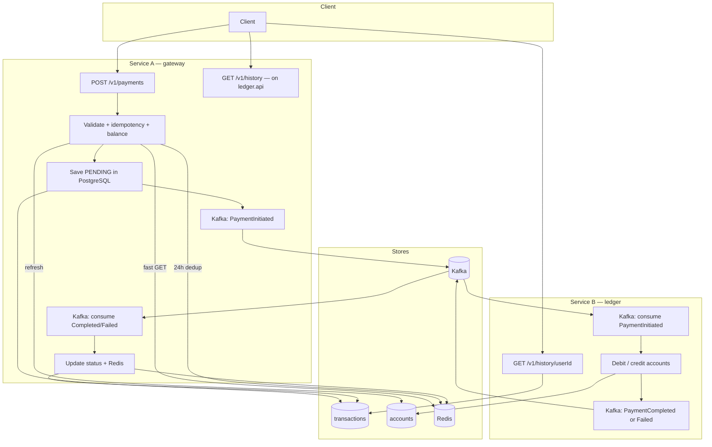
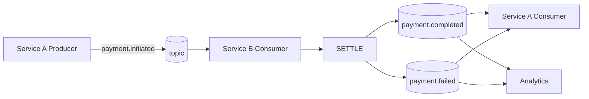

# SwiftPay — Codebase Guide (for juniors)

This document explains **where code lives**, **what to name things**, and **how a payment flows** through the system.

---

## 1. Folder structure (Maven modules)

```
transaction-gateway-service/
├── swiftpay-shared/          ← jar: events, exceptions, enums (no Spring Boot)
├── gateway-service/          ← Service A — port 8080 (GatewayApplication)
└── ledger-service/           ← Service B — port 8081 (LedgerApplication)
```

### Packages (gateway-service + ledger-service)

```
com/swiftpay/
├── shared/                           ← swiftpay-shared module
│   ├── event/                        ← Kafka message shapes (PaymentInitiated, etc.)
│   ├── exception/                    ← API errors (400, 404, 422, 409)
│   └── domain/enums/                 ← TransactionStatus (PENDING, COMPLETED, FAILED)
│
├── gateway/                          ← SERVICE A — Transaction Gateway
│   ├── controller/                   ← REST + dto/
│   ├── service/                      ← PaymentService, PendingPaymentService, idempotency
│   │   └── validation/               ← PaymentRequestValidator
│   ├── application/mapper/           ← DTO ↔ entity/event mappers
│   ├── entity/                       ← JPA entities
│   ├── repository/                   ← PaymentRepository (Postgres), TransactionJpaRepository
│   ├── cache/                        ← Redis: idempotency, balance, dedup, status
│   ├── client/                       ← LedgerBalanceClient (HTTP to ledger)
│   ├── event/                        ← PaymentEventProducer (Kafka publish)
│   ├── model/                        ← PaymentCommand, idempotency helpers
│   ├── config/                       ← Kafka, Redis, HTTP client config
│   └── infrastructure/kafka/         ← PaymentResultKafkaListener (settlement feedback)
│
├── ledger/                           ← SERVICE B — Ledger
│   ├── controller/                   ← Balance + history REST + dto/
│   ├── service/                      ← Settlement, balance/history queries
│   ├── model/                        ← SettlementResult, SettlementOutcome
│   ├── entity/                       ← JPA entities
│   ├── repository/                   ← Domain repos + Spring Data (*JpaRepository)
│   ├── port/
│   └── infrastructure/kafka/         ← Consume PaymentInitiated, emit Completed/Failed
│
├── gateway/config/                   ← (see gateway/config above)
└── ledger/config/                    ← ledger-service only (settlement Kafka, Redis)
```

**Rule of thumb (gateway)**

| Package | What goes here | Example |
|---------|----------------|---------|
| `controller` | HTTP only (+ DTOs) | `PaymentController` |
| `service` | Business flow | `PaymentService`, `PendingPaymentService` |
| `repository` | PostgreSQL | `PaymentRepository` |
| `cache` | Redis | `PaymentIdempotencyCache`, `PaymentBalanceCache` |
| `client` | HTTP to ledger | `LedgerBalanceClient` |
| `event` | Kafka publish | `PaymentEventProducer` |
| `application/mapper` | Request mapping | `PaymentCommandMapper` |

**Ledger** still uses `port/` + `infrastructure/` adapters; gateway keeps logic in the packages above so **Go to Definition** opens the real implementation.

**Constructor injection:** Spring beans use `private final` dependencies and an explicit constructor (no Lombok `@RequiredArgsConstructor`).

---

## 1b. Design notes

| Idea | Gateway | Ledger |
|------|---------|--------|
| One class per job | `PaymentIdempotencyCache` = Redis idempotency code | `SettlementService` + `PaymentSettlementProcessor` |
| HTTP vs domain | `controller.dto` for API; `model.PaymentCommand` inside services | Same pattern |
| Kafka off locally | `PaymentEventProducer` no-ops when `app.kafka.enabled=false` | `NoOpSettlementEventProducer` when Kafka disabled |

---

## 2. Naming conventions

| Thing | Convention | Example |
|--------|------------|---------|
| Entity | Noun, `PaymentTransaction` | Was `Transcation` (typo fixed) |
| REST controller | `*Controller` | `PaymentController` |
| Service (gateway) | `*Service` | `PaymentService`, `PendingPaymentService` |
| Kafka listener | `*Listener` | `PaymentResultKafkaListener`, `PaymentInitiatedKafkaListener` |
| Kafka publish (gateway) | `*Producer` | `PaymentEventProducer` |
| Redis helper (gateway) | `Payment*Cache` / `DuplicatePaymentChecker` | `PaymentIdempotencyCache` |
| HTTP client (gateway) | `*Client` | `LedgerBalanceClient` |
| Repository (gateway) | `PaymentRepository` | Wraps `TransactionJpaRepository` |
| Event | `Payment*Event` | `PaymentInitiatedEvent` |
| Log tag | `[PAYMENT_FLOW]` or `[LEDGER_FLOW]` | Search logs easily |

---

## 3. Whole system flowchart



---

## 4. Kafka-only flowchart



---

## 5. “Where do I change X?”

| Task | Go to |
|------|--------|
| Change payment API | `gateway/controller/PaymentController.java` |
| Add validation rule | `gateway/service/validation/PaymentRequestValidator.java` |
| Change idempotency | `gateway/cache/PaymentIdempotencyCache.java` |
| Change balance check | `PaymentRequestValidator` + `client/LedgerBalanceClient.java` |
| Reject unknown sender/receiver | `PaymentRequestValidator` (HTTP balance → 404) |
| Ledger missing account | `PaymentSettlementProcessor` → FAILED + `account not found` |
| Ledger balance HTTP API | `ledger/controller/LedgerBalanceController.java` → `GET /v1/accounts/{userId}/balance` |
| Change DB save | `gateway/service/PendingPaymentService.java` |
| Change settlement | `ledger/service/PaymentSettlementProcessor.java` |
| Change Kafka topic names | `application.yml` → `app.kafka.topics` |
| Change consumer retry | `gateway/config/KafkaConsumerRetryConfig.java` |
| Change history API | `ledger/controller/LedgerHistoryController.java` |
| New shared event field | `shared/event/PaymentInitiatedEvent.java` (+ all events) |

---

## 6. HTTP endpoints

| Method | Path | Service | Purpose |
|--------|------|---------|---------|
| POST | `/v1/payments` | A | Create payment |
| GET | `/v1/accounts/{userId}/balance?currency=` | B | Authoritative balance (A calls via HTTP) |
| GET | `/v1/payments/{transactionId}` | A (gateway :8080) | Poll payment status |
| GET | `/v1/history/{userId}?limit=` | B (ledger :8081) | Transaction history (reporting) |
| GET | `/health`, `/health/ready`, `/health/live` | — | DB + Redis + Kafka health |
| GET | `/swagger-ui.html` | — | OpenAPI / Swagger UI |
| GET | `/actuator/health` | — | Actuator health (same components) |

**Redis keys (24h where noted)**

| Key | Purpose |
|-----|---------|
| `idempotency:{Idempotency-Key}` | 24h idempotency lock / COMPLETED / FAILED |
| `tx:processed:{transactionId}` | 24h — transaction must not be processed twice |
| `balance:{userId}` | Cached balance for fast validation on Service A |
| `tx:status:{transactionId}` | Final status after settlement feedback |

**Service A before PENDING:** idempotency lock → HTTP `GET /v1/accounts/{sender}/balance` (Service B) → seed `balance:{sender}` in Redis → Redis GET balance check → reserve `tx:processed:{id}` → save → Kafka.

**Service B settlement:** one `@Transactional` — lock transaction + accounts, insufficient funds → FAILED (no debit), else debit/credit + COMPLETED.

---

## 7. Run locally

```powershell
cd D:\transaction-gateway-service
docker compose up -d postgres redis kafka
# IDE: run LedgerApplication (8081) then GatewayApplication (8080)
.\mvnw.cmd -B clean verify
```

Or full stack: `docker compose up --build`
