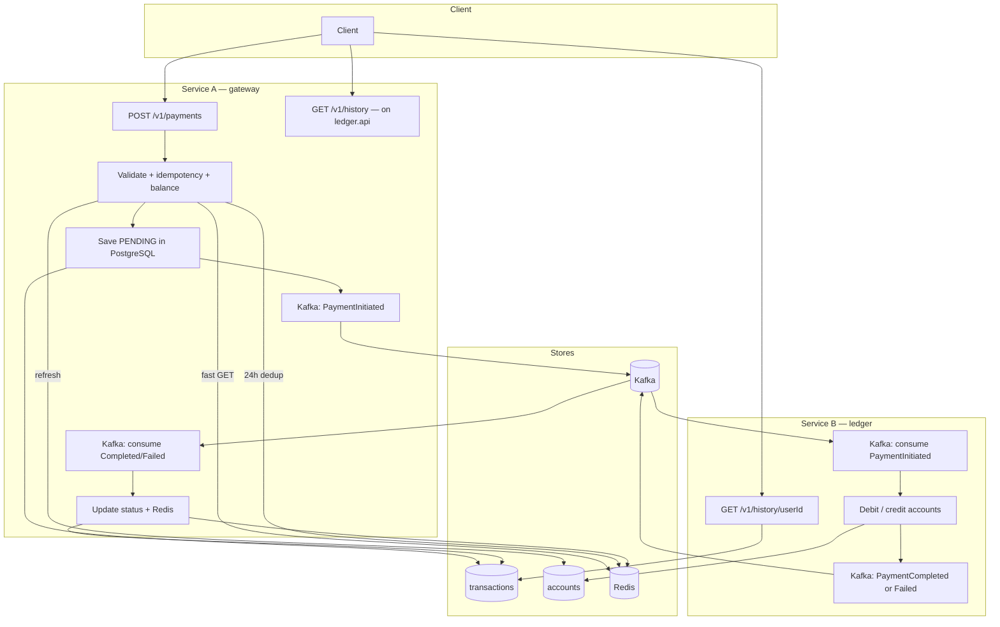
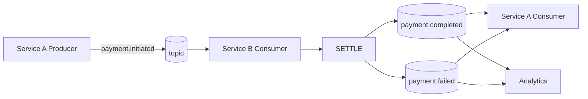

# SwiftPay — Codebase Guide (for juniors)

This document explains **where code lives**, **what to name things**, and **how a payment flows** through the system.

---

## 1. Folder structure (Maven modules)

```
transaction-gateway-service/
├── swiftpay-shared/          ← jar: events, exceptions, enums (no Spring Boot)
├── gateway-service/          ← Service A — port 8080 (GatewayApplication)
└── ledger-service/           ← Service B — port 8081 (LedgerApplication)
```

### Packages (gateway-service + ledger-service)

```
com/swiftpay/
├── shared/                           ← swiftpay-shared module
│   ├── event/                        ← Kafka message shapes (PaymentInitiated, etc.)
│   ├── exception/                    ← API errors (400, 404, 422, 409)
│   └── domain/enums/                 ← TransactionStatus (PENDING, COMPLETED, FAILED)
│
├── gateway/                          ← SERVICE A — Transaction Gateway
│   ├── controller/                   ← REST controllers + dto/
│   ├── service/                      ← Payment orchestration, persistence, status
│   ├── application/                  ← Validators, mappers, idempotency outcomes
│   │   ├── validation/
│   │   ├── idempotency/
│   │   └── mapper/
│   ├── entity/                       ← JPA entities
│   ├── repo/                         ← Spring Data repositories
│   ├── model/                        ← PaymentCommand (app input)
│   ├── port/                         ← Interfaces (contracts for adapters)
│   └── infrastructure/               ← Redis, Kafka, HTTP clients, JPA adapters
│       ├── redis/
│       ├── kafka/                    ← Gateway Kafka producer + feedback consumer
│       └── persistence/              ← JPA + account balance read for cache refresh
│
├── ledger/                           ← SERVICE B — Ledger
│   ├── controller/                   ← Balance + history REST + dto/
│   ├── service/                      ← Settlement, balance/history queries
│   ├── model/                        ← SettlementResult, SettlementOutcome
│   ├── entity/                       ← JPA entities
│   ├── repo/                         ← Spring Data repositories
│   ├── port/
│   └── infrastructure/kafka/         ← Consume PaymentInitiated, emit Completed/Failed
│
├── gateway/config/                   ← gateway-service only (Kafka producer, Redis, HTTP client)
└── ledger/config/                    ← ledger-service only (settlement Kafka, Redis)
```

**Rule of thumb**

| Layer | What goes here |
|--------|----------------|
| `controller` | HTTP only (+ request/response DTOs) |
| `service` | Use cases / orchestration |
| `application` | Validators, mappers, shared models |
| `domain` | Tables / entities |
| `port` | Interfaces |
| `infrastructure` | Redis, Kafka, DB implementations |

---

## 1b. SOLID principles (how this repo applies them)

| Principle | Meaning here | Examples |
|-----------|----------------|----------|
| **S** — Single responsibility | One class, one reason to change | `PaymentInitiatedEventValidator`, `PaymentInitiatedSettlementHandler`, `RedisTransactionStatusCache` |
| **O** — Open/closed | Extend via new adapters, not editing core logic | New `BalanceStore` impl; `NoOpPaymentEventPublisher` when Kafka off |
| **L** — Liskov substitution | Ports can be swapped in tests/prod | `RedisBalanceStore` / mocks implement `BalanceStore` |
| **I** — Interface segregation | Small ports, not full `JpaRepository` in application code | `SettlementAccountStore`, `TransactionStatusWriter`, `TransactionStatusCache` |
| **D** — Dependency inversion | Application depends on `port.*`, not Redis/JPA types | `LedgerSettlementService` → `SettlementAccountStore`; listeners → handlers |

**Do not** inject `RedisBalanceStore` or `TransactionRepository` into `service` classes — use the matching **port**.

**DIP in practice:** HTTP DTOs stay in `controller.dto`. Services and ports use `model.PaymentCommand`. The controller maps once via `PaymentCommandMapper.fromRequest(...)`.

**Constructor injection:** Spring beans use `private final` dependencies and an explicit constructor (no Lombok `@RequiredArgsConstructor`). Tests may still use `@Autowired` on fields.

---

## 2. Naming conventions

| Thing | Convention | Example |
|--------|------------|---------|
| Entity | Noun, `PaymentTransaction` | Was `Transcation` (typo fixed) |
| REST controller | `*Controller` | `PaymentController` |
| Use case interface | `*UseCase` | `PaymentInitiationUseCase` |
| Use case impl | `*Service` | `PaymentInitiationService` |
| Kafka listener | `*Listener` | `PaymentInitiatedListener` |
| Kafka publisher | `*Publisher` | `KafkaPaymentEventPublisher` |
| Port | Noun | `BalanceStore`, `IdempotencyGuard` |
| Adapter | Technology prefix | `RedisBalanceStore`, `JpaTransactionWriter` |
| Event | `Payment*Event` | `PaymentInitiatedEvent` |
| Log tag | `[PAYMENT_FLOW]` or `[LEDGER_FLOW]` | Search logs easily |

---

## 3. Whole system flowchart



---

## 4. Kafka-only flowchart



---

## 5. “Where do I change X?”

| Task | Go to |
|------|--------|
| Change payment API | `gateway/controller/PaymentController.java` |
| Add validation rule | `gateway/application/validation/` |
| Change idempotency | `gateway/infrastructure/redis/RedisIdempotencyGuard.java` |
| Change balance check | `SufficientBalanceValidator` + `BalanceCacheRefresher` + `HttpLedgerBalanceReader` |
| Reject unknown sender/receiver | `AccountExistenceValidator` (HTTP balance → 404) |
| Ledger missing account | `LedgerSettlementService` → FAILED + `account not found` |
| Ledger balance HTTP API | `ledger/controller/LedgerBalanceController.java` → `GET /v1/accounts/{userId}/balance` |
| Change DB save | `gateway/service/PaymentPersistenceService.java` |
| Change settlement | `ledger/application/LedgerSettlementService.java` |
| Change Kafka topic names | `application.yml` → `app.kafka.topics` |
| Change consumer retry | `infrastructure/config/KafkaConsumerRetryConfig.java` |
| Change history API | `ledger/controller/LedgerHistoryController.java` |
| New shared event field | `shared/event/PaymentInitiatedEvent.java` (+ all events) |

---

## 6. HTTP endpoints

| Method | Path | Service | Purpose |
|--------|------|---------|---------|
| POST | `/v1/payments` | A | Create payment |
| GET | `/v1/accounts/{userId}/balance?currency=` | B | Authoritative balance (A calls via HTTP) |
| GET | `/v1/history/{userId}?limit=` | B (ledger :8081) | Transaction history |
| GET | `/health`, `/health/ready`, `/health/live` | — | DB + Redis + Kafka health |
| GET | `/swagger-ui.html` | — | OpenAPI / Swagger UI |
| GET | `/actuator/health` | — | Actuator health (same components) |

**Redis keys (24h where noted)**

| Key | Purpose |
|-----|---------|
| `idempotency:{Idempotency-Key}` | 24h idempotency lock / COMPLETED / FAILED |
| `tx:processed:{transactionId}` | 24h — transaction must not be processed twice |
| `balance:{userId}` | Cached balance for fast validation on Service A |
| `tx:status:{transactionId}` | Final status after settlement feedback |

**Service A before PENDING:** idempotency lock → HTTP `GET /v1/accounts/{sender}/balance` (Service B) → seed `balance:{sender}` in Redis → Redis GET balance check → reserve `tx:processed:{id}` → save → Kafka.

**Service B settlement:** one `@Transactional` — lock transaction + accounts, insufficient funds → FAILED (no debit), else debit/credit + COMPLETED.

---

## 7. Run locally

```powershell
cd D:\transaction-gateway-service
docker compose up -d postgres redis kafka
# IDE: run LedgerApplication (8081) then GatewayApplication (8080)
.\mvnw.cmd -B clean verify
```

Or full stack: `docker compose up --build`
